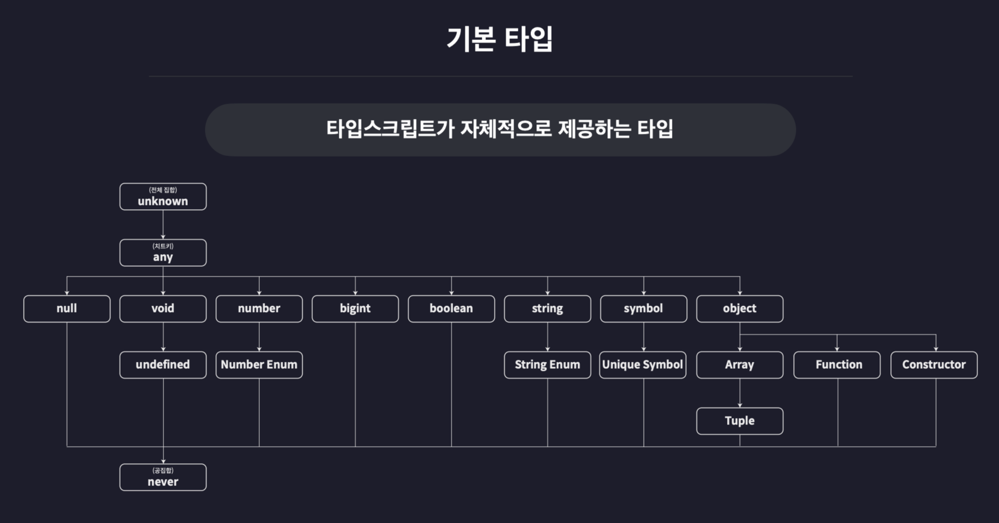

## 0. 기본 타입
- 타입스크립트가 기본적으로 제공하는 타입



## 1. 원시타입과 리터럴타입

### 원시 타입

- 한 개의 값만 저장할 수 있는 타입
- 여러 타입 중 가장 기본이 되는 타입

> **‘타입 주석’** 또는 **‘타입 어노테이션’  :** 변수의 이름 뒤에 콜론(:)과 함께 변수의 타입을 정의하는 문법
// let num1`: number` = 123;
> 

- number 타입
    - 숫자를 의미하는 모든 값을 포함하는 타입
    - 단순 정수 뿐만 아니라 소수, 음수, Infinity, NaN등의 특수한 숫자들도 포함
- string 타입
    - 문자열을 의미하는 타입
    - 단순 쌍따옴표 문자열 뿐만 아니라 작은 따옴표, 백틱, 템플릿 리터럴로 만든 모든 문자열을 포함
- boolean 타입
    - 참과 거짓만을 저장하는 타입
- null 타입
    - 오직 null 값만 포함하는 타입
- undefined 타입
    - 오직 undefinded 값만 포함하는 타입

- **null 값을 다른 타입의 변수에 할당하기**
    - 아직 값이 정해지지 않은 변수에 대해 null 을 임시로 넣고 싶은데, 타입스크립트에서 이미 타입 선언을 한 변수의 경우에는 오류로 체크하게 됨
    - tsconfig.json의 strcitNullChecks(엄격한 null 검사) 옵션을 false로 설정하면 - 임시 null 값을 넣을 수 있음
        - strcitNullChecks은 strict 옵션의 하위 옵션이기 때문에, strict 옵션에 맞춰 자도으로 지정.
        - 별도로 직접 설정하면 설정한 옵션에 따르게 됨
    
    ```json
    {
      "compilerOptions": {
        ...
        "outDir": "dist",
        "strict": true,
    		"strictNullChecks": false,
    		...
      },
      "ts-node": {
        "esm": true
      },
      "include": ["src"]
    }
    ```
    
- 리터럴 타입
    - 범용적으로 많은 값을 포함하는 타입이 아닌, 단 하나의 값만 포함 - 다른 값을 설정하는 것 자체가 안됨
    - 숫자, 문자열, 불리언 타입 값으로 리터럴 타입을 만들 수 있음