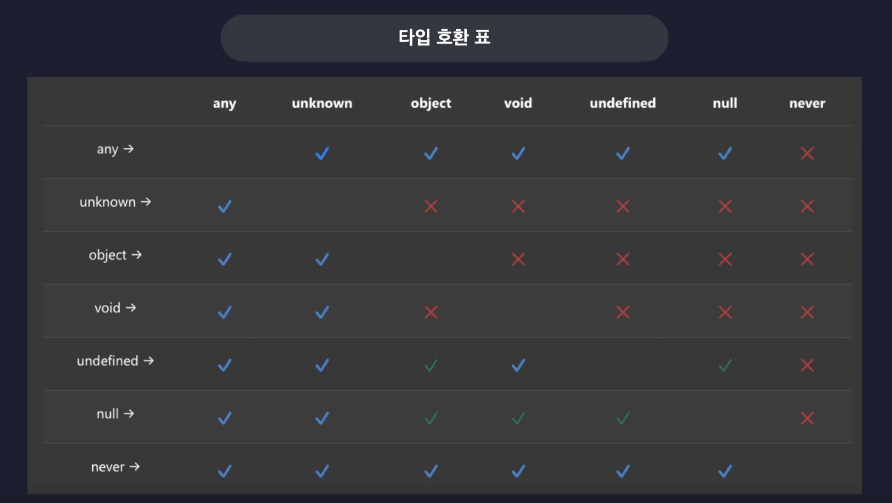

# 3. 타입스크립트 이해하기

## 1. 타입은 집합이다!

- 타입스크립트의 ‘타입’은 여러개의 값을 포함하는 ‘집합’ = 동일한 속성을 갖는 요소들을 하나의 그룹으로 묶은 단위
    - 모든 타입들은 집합으로써 서로를 포함하고 또 포함되는 관계를 갖고 있음
    - 슈퍼 타입(부모타입) : 다른 타입을 포함하는 타입
    - 서브 타입(자식타입) : 다른 타입에게 포함되는 타입
    
    
    
- 모든 관계를 계층화 해서 나타내면, 아래와 같은 타입 계층도가 됨
    
    
    
    - 타입 호환성 :
        - 어떤 타입을 다른 타입으로 취급해도 괜찮은지 판단하는 것
        - 즉, 슈퍼 타입은 서버 타입을 가지고 있으므로
            - 서버 타입을 슈퍼타입으로 판단하여 할당 할 수 있음. (업케스팅)
            - 슈퍼 타입을 서브타입으로 판단하여 할당하는 것은 대부분 되지 않음 (다운 케스팅)
            
            
            

## 2. 타입 계층도와 함께 기본 타입 살펴보기

### unknown 타입

- 타입 계층도의 최상단 = 모든 타입의 슈퍼 타입 =  전체 집합 = 모든 타입의 값을 할당받을 수 있음 (업케스팅)
- 어떤 타입의 변수에도 할당할 수 없음 (다운 케스팅) _ any 제외

### ****never 타입 (공집합 타입)****

- 타입 계층도 맨 아래 = never 타입은 불가능, 모순 = 공집합 (아무것도 포함하지 않음) = 모든 타입의 서브타입 = never 타입을 모든 타입으로 할당 가능 (업 케스팅)
- 그 어떤 타입도 never 타입으로 할당 할 수 없음 (다운 케스팅)

### void 타입

- 아무것도 반환하지 않는 함수의 반환값 타입으로 주로 사용, unddfined 타입의 슈퍼타입
- void 타입으로 선언한 함수에서 undefined 반환 가능 (업케스팅)

### any 타입

- 치트키, 타입 계층도를 무시
- 모든 예외, 모든 타입의 슈퍼타입이 될 수 이고 모든 타입의 서브타입이 될 수 있음 = 다운케스팅 가능
- **예외! )) never 타입으로 다운 케스팅은 되지 않는다.** *(공집합이니까)*
- 사용하지 않은 것이 좋다

### 타입 호환표

- 타입 계층도와 마찬가지로 업-다운캐스팅으로 호환 가능한지 보여주는 표


## 3. 객체 타입의 호환성

- 어떤 객체타입을 다른 객체타입으로 취급해도 괜찮은가?
- 프로퍼티를 기준으로 정의(구조적 타입 시스템) → 조건이 더 적은 타입이 슈퍼 타입이 됨
- 초과 프로퍼티 검사
    - 변수를 객체 리터럴로 초기화 할 때, 발동하는 타입스크립트의 특수한 기능
        - 함수의 매개변수에 인수로 값을 전달하는 과정에서도 동일
    - 타입에 정의된 프로퍼티 외의 다른 초과된 프로퍼티를 갖는 객체를 변수에 할당 할 수 없도록 막음
    - 즉, 변수 타입에 정의된 프로퍼티만을 써야 한다. → 추가 프로퍼티를 넣고 싶다면 다른 타입을 정의한 변수를 사용해야 함

## 4. 대수타입

- 여러개의 타입을 합성해서 새롭게 만들어낸 타입
- 합집합 / 교집합 타입

### union 타입 (합집합)

- 바 `|` 를 이용하여 타입을 합쳐 집합을 크게 만들 수 있음
- 배열 타입 정의도 동일하게 적용

```tsx
let a: string | number;
let arr: (number | string | boolean)[] = [1, "hello", true];
```

### intersection 타입 (교집합)

- 앤드 `&` 를 이용하여 타입이 공통으로 갖는 부분을 인터섹션 타입으로 정의할 수 있음
- 대다수의 기본 타입들 간에는 서로 공유하는 교집합이 없어, never 타입이 됨.
- 객체 타입에서 사용 시, 각 객체의 모든 프로퍼티를 가진 객체만 가능.

## 5. 타입 추론

- 타입이 정의되어 있지 않은 변수의 타입을 자동으로 추론하는 타입스크립트의 기능
- 변수의 초기값 / 함수의 반환값을 기준으로 추론함
    - 함수의 매개변수에 기본값이 정해져 있다면, 추론 가능
    - 기본값이 없는 매개변수만 쓸 경우, 추론이 불가능해서 오류 판단

- 주의할 상황
    - 암묵적 any 타입 추론 - any 타입의 진화
        - 초기값을 넣지 않으면 암묵적으로 any 타입이 되어, 어떤 값을 넣느냐에 따라 메서드 사용 등에 영향을 미침
        
        ```tsx
        let d; //여기서는 any 타입으로 추론
        d = 10; // number 타입으로 인식
        d.toFixed(); // 때문에, number 타입의 메서드 사용 가능
        
        d = "hello"; // 재할당할 경우, 그에 맞춰 타입을 변경함 - string 으로 인식
        d.toUpperCase(); // 문자열 타입의 메서드 사용 가능
        d.toFixed(); // number 타입의 메서드는 사용 불가능 - 오류
        ```
        
    - const 상수 추론
        - 상수는 초기화 때 설정한 갑을 변경할 수 없기 때문에, 특별히 가장 좁은 타입으로 추론됨
    - 최적 공통 타입
        - 다양한 타입의 요소를 담은 배열의 경우에는 유니온 타입 등 최적의 공통 타입으로 추론됨
    - 타입 넓히기
        - 넘버 리터럴 등에서 상수를 추론하듯이 그대로 추론하지 않고, number 타입으로 추론하는 과정
        - const 로 선언한 상수가 아니면 타입 넓히기를 통해 범용적으로 변수를 사용할 수 있도록 추론 함

## 6. 타입 단언

- `값 as 타입` 으로 특정 값을 원하는 타입으로 단언하는 것
- 초과 프로퍼티 검사를 피하거나, 빈 객체로 먼저 넣어두고 진행하고 싶을 때 사용함
- 타입 업케스팅/다운케스팅 과 변개로 타입스크립트의 눈을 가리는 느낌이라, 사용에 유의해야 함

- 타입 단언의 조건
    - A as B 로 단언 할 때, A가 B의 슈퍼타입 이거나 서브타입 이어야 한다.
- 다중 단언
    - 왼쪽에서 오른쪽으로 단언을 진행(하여 여러 타입을 거쳐 최종적으로 다른 타입으로 변경하는 것.. )
    - 슈퍼 - 서브 관계를 갖지 않는 타입으로 단언하면 오류가 발생할 확률이 매우 높으므로 매우 좋지 않은 방식
    - 최대한 사용하지 않고 어쩔 수 없는 경우에만 이용하기를 권장
    
    ```tsx
    let num3 = 10 as unknown as string;
    // number 타입의 값을 unknown 타입으로 단언 -> unknown 타입의 값을 string 타입으로 단언
    ```
    
- const 단언
    - 마치 const 로 변수를 선언한것과 같은 비슷하게 변경됨
    - 객체의 경우 모든 프로퍼티가 readonly 로 변경됨
- Non Null 단언
    - undefined이거나 null이 아닐것으로 단언
    - 값 뒤에 ! 를 붙임 → 즉, 필수값 표시
    

## 7. 타입 좁히기

- 조건문 등을 이용하여 넓은 타입에서 좁은 타입으로 타입을 상황에 따라 좁히는 방법
- 타입 가드 : `if (typeof === …)` 조건문 등을 사용해 타입을 좁히는 표현
    - instanceof 타입 가드
        - 내장 클래스 타입을 보장하는지 확인하여 타입 좁히기를 진행
        - `값 instanceof 내장 클래스 타입`
    - in 타입 가드
        - 직접 만든 타입과 사용하여 타입 좁히기를 진행
        - 값 안에 해당 프로퍼티가 있는지 등을 확인하는 것으로 함.
        - 이때 값은 null 이면 안된다면, `값 && "프로퍼티" in 값` 으로 표기하여 값이 있고, 그 값 안에 해당 프로퍼티가 있는지로 체크

```tsx
type Person = {
  name: string;
  age: number;
};

function func(value: number | string | Date | null | Person) {
  if (typeof value === "number") {
    console.log(value.toFixed());
  } else if (typeof value === "string") {
    console.log(value.toUpperCase());
  } else if (value instanceof Date) {
    console.log(value.getTime());
  } else if (value && "age" in value) {
    console.log(`${value.name}은 ${value.age}살 입니다`)
  }
}
```

## 8. 서로소 유니온 타입

- 교집합이 없는 타입들로만 만든 유니온 타입
- 태그를 붙여 객체를 완벽히 구분지어 사용하여, 태그드 유니온이라고도 함.