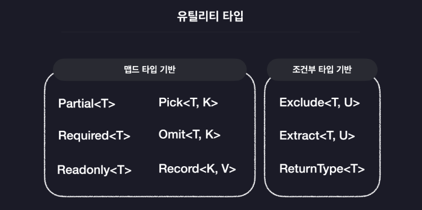

# section10. 유틸리티 타입

- 타입 스크립트가 자체적으로 제공하는 특수한 타입들
- 제네릭, 맵드 타입, 조건부 타입 등의 타입 조작 기능을 이용해 실무에서 자주 사용되는 유용한 타입들을 모아 놓은 것
- 참고 링크 :

[Documentation - Utility Types](https://www.typescriptlang.org/docs/handbook/utility-types.html)

## 1. \***\*Partial, Required, Readonly\*\***

### \***\*Partial<T>\*\***

- 특정 객체 타입의 모든 프로퍼티를 선택적 프로퍼티로 변환
  - 기존 객체 타입에 정의된 프로퍼티들 중 일부분만 사용할 수 있도록 도와주는 타입
- 임시 저장과 같은, 전체 내용이 없는 상태에서 저장해야할 때 사용

### \***\*Required<T>\*\***

- 특정 객체 타입의 모든 프로퍼티를 필수(선택적이지 않은) 프로퍼티로 변환

### \***\*Readonly<T>\*\***

- 특정 객체 타입의 모든 프로퍼티를 읽기 전용 프로퍼티로 변환

## 2. \***\*Record, Pick, Omit\*\***

### \***\*Pick<T, K>\*\***

- 특정 객체 타입으로부터 특정 프로퍼티 만을 골라내는 그런 타입

### \***\*Omit<T, K>\*\***

- 특정 객체 타입으로부터 특정 프로퍼티 만을 제거하는 타입

### \***\*Record<K, V>\*\***

- 객체 타입을 만들어주는 유틸리티 타입

### \***\*Exclude<T, K>\*\***

- T로부터 U를 제거하는 타입

### \***\*Extract<T, K>\*\***

- T로부터 U를 추출하는 타입

### \***\*ReturnType<T>\*\***

- ReturnType은 타입변수 T에 할당된 함수 타입의 반환값 타입을 추출하는 타입
