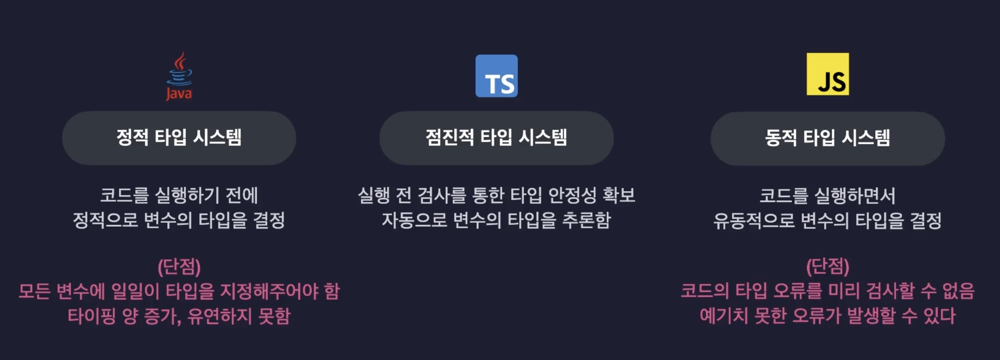

## 1. 자바스크립트의 한계점과 타입스크립트

- 타입시스템 : 언어의 타입과 관련된 문법 체계 (아래 규칙에 대한)
    - 값들을 어떤 기준으로 묶어 타입을 규정할 것인지
    - 코드의 타입을 검사하는 시점은 언제인지
    - 어떻게 타입을 검사할지
    
    
    
- 장단점
    
   
    
- 자바스크립트 with 동적 타입 시스템
    
    ```jsx
    let a = "hello"; //문자열
    a = 123343423 //숫자
    
    a.toUpperCase();
    //실행 시 타입에러 발생: 문자열에만 사용가능한 기능을 숫자를 담고있는 a 변수에 사용했기 때문
    //검사시 실패하면 실행하지 않도록 해야 함.
    //실무에서라면 코드가 많기 때문에 예상치 못한 에러가 될 수 있음
    ```
    
    - 변수의 타입을 코드가 실행되는 도중에 검사 → 변수의 타입을 직접 지정하지 않음
    - 변수의 타입이 하나로만 고정되지 않고, 담긴 값에 따라 변경됨 → 아무 타입의 값이나 자유롭게 담을 수 있음
- 타입스크립트의 독특한 타입시스템 = 동적 타입 + 정적 타입
    - 변수의 타입을 코드 실쟁 전에 결정, 타입 오류를 실행 전에 검사함 (정적)
    - 모든 변수에 타입을 일일이 지정할 필요 없음 (동적) → **점진적 타입 시스템 gradual type system**
        - 타입이 정의된 변수들은 타입을 미리 결정, 타입이 정의되어 있지 않은 변수들은 알아서 초기값을 기준으로 자동으로 타입 추론

## 2. 타입스크립트의 동작 원리

- 프로그래밍 언어의 동작 원리 : 컴파일 과정
    - javascript
        - 사람 - javascript 코드 → AST 변환 → 바이트코드 - 컴퓨터가 실행
    - typescript
        - 사람 - typescript 코드 → AST 변환 → **타입검사 → (타입 검사 성공) javascript 코드** → 바이트코드 - 컴퓨터가 실행
            - 타입스크립트 문법은 컴파일 과정에서 사라지기 때문에, 실행 자체에는 영향을 미치지 않음
        - 사람 - typescript 코드 → AST 변환 → **타입검사 → (타입 검사 실패)** → 컴파일 종료

## 3. Hello TS World!

이제부터는 실습!

1. 폴더 생성 후, Node.js 패키지 초기화 [*터미널 명령어* `npm init` ] - 패키지 정보는 모두 디폴트로
2. node.js 내장 기능들의 타입 정보를 담고있는 @types/node 패키지 설치 [*터미널 명령어*  `npm i @types/node` ]
    
    <aside>
    💡 **왜 설치해야 할까?**
    
    @types/node 라이브러리가 Node.js가 제공하는 기본 기능(내장 함수, 클래스 등)에 대한 타입 정보를 가지고 있음. 만약 이 라이브러리를 설치하지 않으면 Node.js가 제공하는 console 등의 기본 기능(내장 함수 등)들의 타입이 선언되지 않아서 타입스크립트의 컴파일 과정에서 타입 검사가 실패하여 오류가 발생할 수 있기 때문.
    
    </aside>
    
3. 타입스크립트 컴파일러 설치하기 [*터미널 명령어*  `sudo npm i -g typescript` ]

- 타입스크립트 파일 생성 - 확장자 `ts`

```tsx
// src/index.ts

console.log("Hello TypeScript");
const a: number = 1;
```

- tsc 로 컴파일하고 실행하기
    - [*터미널 명령어*  `tsc src/index.ts` ]→ 컴파일 완료되면 자바스크립트 파일 `src/index.js` 이 생성 → node 를 이용하여 자바스크립트 파일을 실행 [*터미널 명령어* `node src/index.js` ]
- ts-node 로 실행하기
    - 명령어 한 번으로 컴파일 후 바로 실행시켜주는 도구 ts-node
    - [*터미널 명령어* `sudo npm i -g ts-node` ]
    - 타입스크립트 실행하기 : [*터미널 명령어*  `ts-node src/index.ts` ]